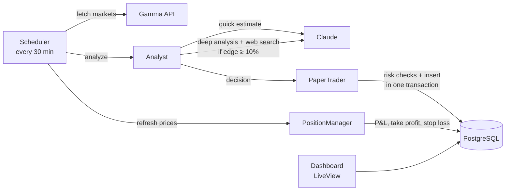

# Polybot

An AI paper-trading bot for [Polymarket](https://polymarket.com) prediction markets.
Claude estimates the probability of an outcome, the bot compares it with the market price
and opens simulated positions when the gap (the *edge*) is large enough.

**Paper trading only.** No orders are placed and no real money is involved. The point of the
project is the engineering around money: exact arithmetic, risk limits that hold under
concurrency, and invariants enforced by the database.

Stack: Elixir, Phoenix LiveView, PostgreSQL (Ecto), Req, Claude API, Polymarket Gamma API.

## How it works



1. `Polybot.Scheduler` (GenServer) scans every 30 minutes.
2. `Polybot.Polymarket.Gamma` fetches active political and sports markets and keeps only
   liquid ones with both YES and NO prices strictly between 0 and 1.
3. `Polybot.AI.Analyst` asks Claude for a probability. If the edge is at least 10%, it runs a
   second, deeper analysis with web search.
4. `Polybot.Trading.PaperTrader` stores every decision and opens a position if the edge and
   the risk limits allow it.
5. `Polybot.Trading.PositionManager` refreshes prices, updates P&L and closes positions on
   take profit (+50%) or stop loss (−40%).
6. `/dashboard` shows open positions and recent decisions, refreshing every 30 seconds.

## Design decisions

**Money is `Decimal`, never float.** Prices, probabilities and amounts are `numeric` in
Postgres and `Decimal` in Elixir, parsed straight from API strings. Decimals are structs, so
`pnl >= 0` is always true; comparisons use `Decimal.compare/2`.

**The model estimates, the code decides.** Claude returns only a probability. The edge is
computed in code; an action that contradicts it becomes `pass`, malformed answers are
rejected. Each side is priced on its own: YES at the YES price, NO at the NO price.

**Risk limits hold under concurrency.** Max 5 open positions, max 50% of capital, one per
market. Checks and insert run in one transaction under `pg_advisory_xact_lock`; without it,
the concurrency test opens 18–19 positions instead of 5. A partial unique index and CHECK
constraints back this up in the database.

**Failures stay local.** One bad market is logged and skipped instead of crashing the
scheduler into a retry loop. Errors that would fail every market (bad key, no credits) stop
the scan; the next scheduled scan retries.

## Running locally

Requirements: Elixir 1.15+, Docker, an Anthropic API key.

```bash
# Postgres
docker run -d --name polybot-pg -e POSTGRES_PASSWORD=postgres -p 5432:5432 postgres:16-alpine

# Dependencies, database, assets
mix setup

# Start the bot and the dashboard
ANTHROPIC_API_KEY=sk-ant-... mix phx.server
```

Open the dashboard link printed in the terminal,
[localhost:4000/dashboard](http://localhost:4000/dashboard). The first scan starts
10 seconds after boot. After a reboot, start the database again with `docker start polybot-pg`.

A Docker setup for a server is included (`Dockerfile`, `docker-compose.prod.yml`,
`deploy.sh`). Migrations run on container start.

## Tests

```bash
mix test        # 71 tests, needs the Postgres container
mix precommit   # compile with warnings as errors, format, test
```

- HTTP calls to Gamma and Claude are stubbed with `Req.Test`; Claude answers are fixtures,
  including malformed ones.
- P&L math lives in a pure module (`Polybot.Trading.Pnl`) and is unit tested on its own.
- `PaperTraderConcurrencyTest` uses real database connections. Inside the SQL sandbox all
  processes share one connection, so a race can't be reproduced there.
- Database constraints are tested with raw SQL that bypasses the application.

## Known limitations

- **Mid prices, no costs.** Positions open at Gamma's outcome prices, not the order book
  ask, and ignore spread, fees and slippage. Real fills would be worse.
- **Fixed capital.** Capital is a constant $1000; realized P&L doesn't flow back into it,
  and there is no trades ledger yet (the `markets` table is unused).
- **The forecaster is unvalidated.** There is no backtest showing that Claude's estimates
  beat the market. This is an engineering project, not a trading strategy.
- **Stale model knowledge.** The quick estimate runs without web search and without
  today's date, so the model relies on its training data. In a live run it described two
  former officials as currently in office. The quick estimate is also what decides whether
  the deep analysis with web search runs at all.
- **Crude market selection.** Markets are picked by keywords in the question. In practice
  this selects many long-shot markets priced at a few percent, where a 10-point edge is
  almost impossible.
- **Synchronous scans.** A scan runs inside the scheduler process, so a manual `run_now/0`
  waits for the current scan.
- **No auth.** The dashboard has no authentication. In dev it binds to `127.0.0.1` only;
  the production compose file exposes port 4000, so put it behind a VPN or a reverse proxy
  with auth before deploying.

## Next version

Measurement comes first: without it, changes to the forecaster can't be evaluated.

1. **Measure forecast quality.** Record each market's outcome after resolution and compare
   the model's probabilities with the market price at decision time (Brier score).
2. **Better forecasts.** Then try, one at a time and measured against step 1:
   - today's date in the prompts;
   - telling the model its knowledge may be outdated and to lower its confidence when the
     answer depends on recent events;
   - more context from Gamma: market description, resolution criteria, recent price changes;
   - web search in the quick stage as well, if the cost is justified.
3. **Realistic execution.** Enter at the order book ask, account for spread, fees and slippage.
4. **Accounting.** A trades ledger with realized P&L flowing back into capital.
5. **Market selection.** Filter by liquidity, time to resolution and price range instead of
   keywords, skipping long shots.
6. **Async scans.** Run scans under a `Task.Supervisor` so `run_now/0` doesn't block.
7. **Dashboard auth** before any deployment.
